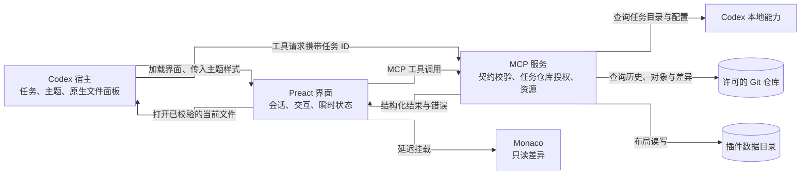
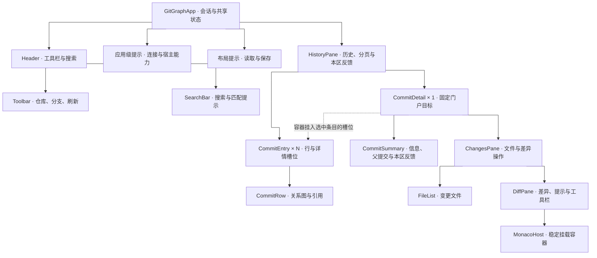
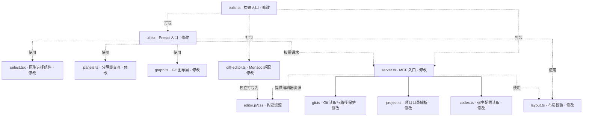

# Git Graph 的 Preact + TypeScript 重构

当前状态：**已完成，两层均已验收**。moss 于 2026-09-25 明确回复“验收通过，提交”，接受 Preact + TypeScript 迁移、提示分区及图线间距修正。本文是跨轮权威工作文档；同名 HTML 仅投影本文。

## 依据：当前插件与约束 {#grounding}

### 证据覆盖

| 类别 | 结论 | 当前证据 |
| --- | --- | --- |
| 治理与来源 | 已核实；工作区无额外 `AGENTS.md`，本次遵循 moss 提供的指令 | 工作区搜索、[README](../README.md) |
| 架构与归属 | 已核实；MCP 服务端负责工具、任务仓库隔离和 HTML 资源，浏览器 UI 通过 MCP App 调工具 | [server.ts](../plugins/git-graph/server.ts)、[ui.tsx](../plugins/git-graph/ui.tsx) |
| 实现约定 | 已核实；手写运行、构建和测试源码均为 `.ts`/`.tsx`；前端使用 Preact 10.29.8；esbuild 打包，Zod 校验输入及布局 | [package.json](../plugins/git-graph/package.json)、[build.ts](../plugins/git-graph/build.ts)、[layout.ts](../plugins/git-graph/layout.ts) |
| 界面与体验 | 已核实；保留 Codex 主题、键盘/焦点、窄面板、失败重试、只读 Monaco 差异 | [README](../README.md)、[ui.test.ts](../plugins/git-graph/ui.test.ts) |
| 质量与工具 | 已核实；严格 TypeScript 检查、Node 集成测试、Playwright 界面测试和临时缓存启动均通过；已安装插件检查仍为可选独立入口 | [package.json](../plugins/git-graph/package.json)、[test.ts](../plugins/git-graph/test.ts)、[ui.test.ts](../plugins/git-graph/ui.test.ts) |
| 发布与运行 | 已核实；插件发布携带 `dist/` 和 `.mcp.json`，运行入口为 `dist/server.mjs`，最低环境为 Node 20.11+ | [README](../README.md)、[build.ts](../plugins/git-graph/build.ts)、[插件清单](../plugins/git-graph/.codex-plugin/plugin.json) |
| 复用与例外 | 已核实；保留 esbuild、Monaco、图布局算法、原生选择控件及布局规则 | [build.ts](../plugins/git-graph/build.ts)、[graph.ts](../plugins/git-graph/graph.ts)、[select.tsx](../plugins/git-graph/select.tsx)、[panels.ts](../plugins/git-graph/panels.ts) |
| 提示与恢复 | 已核实；连接、字号、布局、历史、详情、差异和文件打开分别维护提示；搜索与仓库空态独立呈现；Codex 安装包提供就地加载、失败重试与独立空态的对照 | [ui.tsx](../plugins/git-graph/ui.tsx)、[window.html](../plugins/git-graph/window.html)、[diff-editor.ts](../plugins/git-graph/diff-editor.ts)、本机 Codex 26.917.62051 安装包 |

### 当前责任和关键契约

- `build.ts` 把浏览器脚本与样式内嵌进 `dist/window.html`，分别构建 Monaco 和 Node 服务端，并按插件版本生成 `.mcp.json`。MCP 服务端根据 HTML 内容生成资源 URI，避免宿主继续缓存旧界面。
- `server.ts` 的工具名、Zod 输入、只读标注、任务仓库选择及结构化结果是前后端边界。`git.ts` 保证 Git 访问、历史差异和工作区文件定位的路径安全；布局只写插件数据目录。
- `ui.tsx` 使用 Preact 管理 MCP App 生命周期、页面结构与异步状态。唯一详情由固定门户渲染，目标容器只在父节点变化时移入选中提交的空槽位；列表替换前同步停放。
- `diff-editor.ts` 的 Monaco 实例独占 `#diff-editor` 子树，延迟从 `git_graph_editor` 加载；面板拖拽、测量和焦点操作需要稳定 DOM 引用。现有 UI 测试直接检查详情位置、选择控件结构和窄面板布局。
- 初始只读核查时为干净的 detached HEAD，未安装依赖。第 1 层已通过 `npm ci` 建立依赖，迁移前构建、9 项 Node 测试与产品 UI 回归通过；迁移后验证见下表。

### Codex 提示调研边界

设计调研时只读检查了本机 Codex 26.917.62051 安装包。差异视图和 Pull Request 页面在内容区域使用骨架加载、局部错误与“重试”，部分请求失败时保留已有内容，搜索无结果使用独立空态；明确操作的结果可用短暂 Toast，未决编辑和授权由宿主的确认界面处理。这是当前安装包实现证据，**尚非运行时视觉验收**；没有证据表明 MCP App 可直接调用宿主 Toast。官方[插件要求](https://developers.openai.com/plugins/app-guidelines)要求错误有清晰信息或恢复方式，破坏性操作有明确标签和确认；[宿主通知文档](https://learn.chatgpt.com/docs/notifications)描述任务、权限和问题通知。官方[插件 UI 指南](https://developers.openai.com/plugins/concepts/ui-guidelines)明确面向 ChatGPT，不能据此宣称 Codex Desktop 存在统一的 Toast、横幅或内联提示规范。

迁移后的 Git Graph 用独立的 `Notice` 状态分别承载连接、代码字号、布局、历史、详情、差异、打开文件及仓库信息，移除了混用这些状态的查询横幅 `#error`。搜索计数、加载骨架、无提交与非 Git 目录空态、二进制或超大文件原因及差异计算状态已经各有局部位置。本次迁移对齐 Codex 已观察到的**提示语义和作用域**，不复制宿主专属通知、批准卡或未经证实的 Toast API。

### 外部技术依据

[Preact 官方文档](https://preactjs.com/guide/v10/typescript/)支持 `jsx: react-jsx` 与 `jsxImportSource: preact`；v10 的 [`preact/compat` 门户 API](https://preactjs.com/guide/v10/api-reference/#createportal)可将组件渲染到固定 DOM 容器，[key 教程](https://github.com/preactjs/preact-www/blob/master/content/en/tutorial/08-keys.md)说明稳定 key 用于识别列表条目。[esbuild 官方文档](https://esbuild.github.io/content-types/)说明它能处理 `.ts`/`.tsx`，但不做类型检查。Node 20.11 仍是插件支持边界；开发脚本与测试可由 [tsx 的 Node CLI 入口](https://github.com/privatenumber/tsx/blob/master/docs/dev-api/node-cli.md)执行 TypeScript，发布物仍为 JavaScript。

## 意图：统一源码语言且保持现有行为 {#intent}

### 目标和使用流程

目标是让插件的手写运行、构建、测试源码统一为 TypeScript；浏览器界面由 Preact 组件管理。直接使用方仍是在 Codex 任务侧面板中浏览当前项目 Git 历史的人。打开面板后，宿主连接 MCP App，读取任务仓库与历史；用户可切仓库/分支、搜索、展开提交、选择父提交和文件、查看只读历史差异、打开仍存在的当前工作区文件，并调整布局。

发生非 Git 目录、查询失败、布局读写失败、编辑器加载失败或过期异步响应时，保留当前说明、重试与恢复语义，并让提示在所属区域出现；互不相关的失败可同时看见，局部失败不清空仍有效的内容。键盘焦点、无障碍名称、明暗主题和窄面板布局保持可用。

### 整体架构（职责抽象）

下图表达运行时职责、调用关系与主要结果流；方框不是新增文件、类或独立进程的要求。

| 责任边界 | 持有的状态与行为 | 对外契约 |
| --- | --- | --- |
| Codex 宿主 | 任务身份、主题与字体、原生文件面板 | 工具请求向服务端携带任务 ID；向界面传主题样式；接收当前文件打开请求 |
| Preact 界面 | 仓库和提交选择、分页、搜索、详情、错误重试及过期响应控制 | 只通过既有 MCP 工具获取 Git 和布局数据；Monaco 独占自己的挂载容器 |
| MCP 服务 | 工具与 HTML 资源、输入校验、每个任务许可的仓库集合、结构化结果和错误 | 对选中仓库重新核权，向本地能力发起受限操作 |
| 本地能力 | Git 对象与工作区文件定位；插件目录中的布局；Codex 项目目录与代码字号 | Git 历史只读，布局只写插件数据目录，当前文件路径经服务端检查 |

核心路径是“界面发起操作 → MCP 服务校验任务与输入 → 本地 Git 或布局数据 → 结构化结果 → 界面呈现”。打开当前文件时，先由服务端确认路径，再调用宿主原生打开能力。构建与运行分离：esbuild 将 TypeScript/Preact、样式和 Monaco 打包为现有 HTML、编辑器资源与 Node 服务端入口，并继续生成现有 `.mcp.json` 启动配置。界面树归 Preact 管理；Monaco 只管理自己的容器；这层职责划分不预设额外状态库或通用组件层。

### 可观察验收

1. 手写运行、构建、测试源码迁为 `.ts`/`.tsx`；`npm run typecheck` 无类型错误，`npm run build` 产出原有四类 `dist` 文件和有效 `.mcp.json`。临时插件缓存可用该启动命令实际启动新构建的服务端；生成的 JavaScript 仍供 Node/宿主直接运行。
2. MCP 工具名、输入校验、只读标注、任务仓库隔离、历史快照、路径安全、布局持久化路径及 UI 资源哈希行为保持一致；`npm test` 通过。
3. Preact 管理工具栏、历史、搜索和详情结构；仓库/分支切换、分页、搜索匹配、合并父节点、文件差异和当前文件打开保持一致；加载、空态、信息、失败与重试按提示归属表呈现，过期请求不覆盖新选择或其提示。
4. 宿主主题/字体、Monaco 只读与延迟加载、图形连线、焦点和键盘路径、分隔线操作、430px 与 400px 窄面板行为保持一致；`npm run test:ui` 通过。
5. 新依赖的许可与现有第三方许可清单同步；发布仍无需安装时运行 npm 或请求 CDN；仓库、插件市场身份和现有用户布局数据不迁移。

### 边界

不进行主题或通用视觉改版、功能扩张、MCP 协议变更、Git 数据或插件身份迁移、发布/安装；第 2 层按既定提示归属表调整反馈位置；第 1 层仅迁移构建与 MCP 核心。TypeScript 迁移包含测试和构建脚本；`dist/`、HTML、CSS、SVG、JSON 仍按各自资源格式存在。

## 落实：两层依赖顺序 {#realization}

### 方案选择

选择继续使用 esbuild 打包，并用 TypeScript 独立检查类型；用 `tsx` 执行 Node 20.11 无法直接运行的手写 TS 构建脚本和测试。这样只增加 Preact、TypeScript、Node 类型与 TS 执行所必需的依赖，不引入 Vite 或新的状态库。保留 Zod、Monaco 和现有浏览器回归测试。

### 前端组件架构

以下是界面的职责组合，不规定每个节点单独建组件或文件。实际函数中，`GitGraphApp` 内联历史区域和条目槽位，`Header` 内联工具栏与搜索，`CommitDetail` 内联提交摘要，`ChangesPane` 内联差异区域与 Monaco 容器。`CommitRow`、`RefBadge`、`Highlight`、`Notice`、`ResizeHandle` 与 `FileList` 承载各自复用职责；原生选择控件在 `select.tsx`，图标在 `icons.tsx`。组件只因真实状态或交互职责分界；单个按钮、容器和装饰元素继续留在所属组件内。

| 责任方 | 状态与行为归属 | 现有能力的接入方式 |
| --- | --- | --- |
| `GitGraphApp` | MCP App 连接、仓库/分支与已加载历史、选中提交及历史请求代次；只呈现连接和宿主能力等应用级提示 | 统一调用现有 MCP 工具，并应用宿主主题、字体和文件打开能力；将操作结果交给所属区域呈现 |
| 布局提示 | 布局读取与自动保存失败、独立重试；与查询失败可并存，保存成功后清除 | 沿用现有布局校验、串行保存和最新错误规则，不增加成功 Toast |
| `Header` 与 `HistoryPane` | 工具栏传入选择事件；搜索显示已加载历史的匹配信息；列表负责提交行、详情槽位、加载、空态、查询失败与分页重试 | `graph.ts` 保持纯图布局计算，Preact 渲染行 SVG；仓库/分支选择复用现有原生选择结构和样式 |
| `CommitDetail` | 唯一详情实例持有父提交、选中文件与详情请求代次；详情加载、失败和重试留在详情区；刷新时保留仍有效的选择 | 详情紧随选中行，保持图线连接；父提交选择复用同一原生选择结构 |
| 详情位置接点 | 固定详情容器、条目内空槽位与列表外停放点之间的同步移位 | 只移动门户目标容器；Preact 管理槽位节点和容器内部的详情子树，不将容器当普通 JSX 子节点 |
| `DiffPane` 与 `MonacoHost` | 差异请求代次、加载/失败/重试、不可比较原因、计算结果与编辑器生命周期；Preact 管外层标题、按钮和状态 | Monaco 只管理挂载容器内部 DOM，通过 `git_graph_editor` 首次按需取得独立打包的脚本与样式；编辑器接点将差异状态回报给 Preact，切换文件时释放旧模型 |
| 面板交互接点 | 拖动、键盘调整和尺寸测量；布局偏好回传给页面，保存请求串行且只呈现最新错误 | `panels.ts` 保留交互计算；Preact 渲染 CSS 变量、按钮与分隔线的可见和 ARIA 状态，接点不再直接改写这些属性；卸载时断开观察与事件 |

`HistoryPane` 将提交哈希用作 `CommitEntry` 的稳定 key，每个条目在提交行后渲染一个空的详情槽位，且不在 JSX 中声明槽位子节点。`HistoryPane` 和门户在会话内持续挂载，加载、空态与关闭只改变可见状态。详情位置接点独占固定的 `#detail-row` 容器及列表渲染树外的停放点；容器本身不作为普通 JSX 子节点。唯一的 `CommitDetail` 通过 `preact/compat` 门户渲染进这个固定容器，Preact 只管理其内部子树。任何列表更新若会删除或替换含槽位的条目，须在更新前同步停放容器；新槽位挂载后再移入。关闭详情时清空旧差异模型并隐藏停放，保留详情与 Monaco 实例；断开会话时销毁编辑器。这样保持详情位于现有 `listitem` 内并紧随提交行。放大布局需让槽位承接现有详情高度，图线、列表语义与焦点行为保持不变；通过节点身份和编辑器实例断言验证切换提交与关闭重开后未重建。原生选择控件可由一个共享组件声明既有 `<select>` 结构，不能再由命令式代码改写 Preact 管理的子节点。各组件传值与回调，不新增全局状态库。

### 提示与错误归属（Codex 对照）

| 触发 | 目标位置与反馈 | 恢复与无障碍 |
| --- | --- | --- |
| 连接失败、宿主代码字号读取失败 | 应用级提示说明影响；连接失败提示重新打开窗口，字号失败可重试且不阻断历史 | 错误用 `role="alert"`，同一字号失败去重播报并在恢复后清除；重试不夺走当前焦点 |
| 仓库发现部分失败、分支或标签失效 | 历史区说明已找到的仓库与失败项；有仓库时仍可浏览，重新打开面板可重试仓库发现；分支控件旁说明已回退的选择 | 非阻断信息用 `role="status"`，不覆盖其他错误 |
| 首次历史、仓库/分支切换、刷新、分页 | 历史区显示骨架或忙碌状态；失败在本区附“重试”，分页失败保留已加载提交，切换失败恢复有效选择 | `aria-busy` 只覆盖请求所属区域；过期响应及其提示均忽略 |
| 搜索无匹配、无提交、非 Git 目录 | 搜索保留图谱并显示 `0/0 · 已加载历史`；无提交与非 Git 目录分别使用历史空态 | 空态不是错误；说明下一步，不弹 Toast |
| 提交详情读取失败、无文件变更 | 选中行内的详情区显示骨架、失败及重试；无变更说明留在差异区 | 保留选中提交和父提交；失败可就地恢复 |
| 差异或编辑器加载失败；不可比较的文件 | 差异区显示骨架、失败及重试；二进制、超过 2 MiB、非 UTF-8 的不可比较原因留在差异区；缺失版本和模式变化显示在基准/目标版本说明 | 保留选中文件；不可比较原因是说明，不冒充查询失败 |
| 差异计算中、差异数、文本相同、换行符或 BOM 变化、未能完整计算 | 差异区状态行呈现，不覆盖文件内容或其他错误 | 进度和结果用 `role="status"` / 礼貌播报 |
| 打开当前工作区文件失败 | 文件操作附近给出原因和重试；成功交给 Codex 原生文件面板，不重复报成功 | 保留文件选择；宿主权限与批准由宿主处理 |
| 布局读取或自动保存失败 | 独立布局提示持续到成功，可重试；不覆盖历史、详情、差异提示 | 自动保存成功静默；无破坏性动作，不引入确认弹窗 |

这些是各区域已有状态的组织规则，不要求每种提示单独建组件或文件。只读浏览、原生打开文件和布局自动保存没有新增确认步骤；宿主任务通知与批准卡不在 Git Graph 面板内复制。

### 实现组合树（模块归属）

组件结构见上图；本图只列模块归属与复用引用，虚线不是包含关系。共享的布局契约只出现一次。省略单个按钮、私有辅助函数、测试用例与非编辑器生成文件。差异适配器已迁为 `diff-editor.ts`，仍独立打包并由服务端按需提供；Monaco 只管理自身容器，不把内部 DOM 交给 Preact。移除旧 `.mjs` 源码发生在对应新入口通过验证之后。

### 执行层与依赖

| 层 | 边界与当前状态 | 修改方向 | 聚焦验证 |
| --- | --- | --- | --- |
| 1. TypeScript 构建与 MCP 核心 | 已完成；无前置层 | 建立 TS/TSX 编译、类型检查和 Node 运行方式；迁移 `build`、服务端、Git/项目/布局/图逻辑、Node 测试及 `installed.test.ts`。现有 UI 暂用 JS，但同步修正它及 UI 测试的模块导入，并让暂留 UI 测试通过 TS 执行器运行。用临时 `CODEX_HOME` 缓存测试新生成的启动命令，不要求安装插件；补齐新增工具依赖许可。 | `npm run typecheck`、`npm run build`、`npm test`、`npm run test:ui`、临时缓存启动测试；核对 `dist` 路径、MCP 工具与资源哈希 |
| 2. Preact 界面 | 已完成；依赖层 1 | 让 Preact 拥有页面结构和状态，按上表调整现有提示归属，迁移选择控件、分隔线、Monaco 接点、预览及 UI 测试为 TS/TSX；按验证结果移除旧前端 JS，更新 README 的当前实现说明与 Preact 依赖许可。 | `npm run typecheck`、`npm run build`、`npm test`、`npm run test:ui`；聚焦覆盖局部失败与重试、并存提示、空态与礼貌播报；临时缓存启动测试，本机恰有同版本安装时另跑 `npm run test:installed` |

第 1 层已完成；第 2 层实现、验证与最终验收均已完成。

### 风险与检查点

- Node 20.11 不能直接运行 `.ts`，所以先让构建脚本与测试入口可执行，再改服务端导入路径；运行时仍指向 `dist/server.mjs`。已安装缓存检查只证明旧安装，必须另用临时缓存启动新构建。
- 将当前 `#detail-row` 的命令式移位收敛到受限位置接点，使用固定门户目标与条目内专属槽位，保持它紧随选中行和图线连续；验证切换提交及关闭重开后详情节点与 Monaco 实例身份不变，也不泄漏旧模型。
- 宿主只允许内嵌 UI 资源；保持 Monaco 的延迟加载、Worker 与样式内嵌，验证 CSP 和离线打开。
- 当前测试强关联真实可见 DOM，保留产品上有意义的 ID、角色及键盘行为；只因实现变化调整无意义的内部断言。

### 第 1 层实施与验证结果（历史记录）

迁移 `build.ts`、`server.ts`、`git.ts`、`project.ts`、`codex.ts`、`layout.ts`、`graph.ts`、`test.ts` 与 `installed.test.ts`，移除相应旧 `.mjs` 源文件。新增严格 `tsconfig.json` 和 SVG 模块声明，使用 TypeScript 7.0.2、tsx 4.23.15 与 Node 20 类型；类型在责任模块内声明，布局类型从现有 Zod schema 推导。工具定义保留 schema 与处理函数的类型关系，共享调用路径继续执行仓库授权和路径核查。当时前端 `ui.mjs` 与 `ui.test.mjs` 仅更新导入路径，UI 测试改用 tsx 执行。

| 验证 | 当前结果 |
| --- | --- |
| `npm run typecheck` | 通过；覆盖本层全部 TS 源码、构建和测试 |
| `npm run build` | 通过；产出 `dist/server.mjs`、`window.html`、`editor.js`、`editor.css`；生成的 `.mcp.json` 启动契约未变 |
| `npm test` | 9 项通过；含 Git 只读、历史/差异、路径边界、仓库隔离、资源哈希、布局和配置 |
| `npm run test:ui` | 通过；主题、搜索、原位详情、分隔线、宽窄布局、Monaco、CSP、重试及过期响应 |
| `npm run test:launcher` | 1 项通过；只复制 dist 到临时缓存，启动新构建并校验 Home 回退、HTML 和编辑器资源 |
| Node.js 20.11.0 | 类型检查、构建、9 项 Node 测试和临时缓存启动检查均通过 |
| 许可与说明 | 新工具依赖的 LICENSE/NOTICE 已补入现有第三方许可文件；README 同步当前源码与验证入口 |

UI 基线首次在沙箱内因 macOS MachPort 权限而无法启动 Chromium；通过工具权限流程在沙箱外运行同一产品测试后，迁移前后均通过。方案页没有借此重新访问，浏览器运行验证仍标记为按用户确认跳过。`npm run test:installed` 检查的是已安装缓存，本层以新构建的临时缓存启动验证为依据；未安装或发布插件。

只读评审：本层实现、依赖和验证符合既定范围，未发现阻断问题。该记录形成时第 2 层尚未实施，当前结果见下节。经验审计：本轮类型迁移及新增测试命令为项目实现事实，已同步 README 与本方案；未新增全局技能规则。

### 第 2 层实施与验证结果

使用 Preact 10.29.8 迁移 `ui.tsx`、`select.tsx`，将现有图标原样提取到 `icons.tsx`。`panels.ts` 保留拖拽、键盘和尺寸计算，布局属性由 Preact 渲染；`diff-editor.ts` 保留 Monaco 主题、模型与独立资源加载，外层状态回传 Preact。`preview-theme.ts` 与 `ui.test.ts` 完成严格类型迁移。`window.html` 保留样式和根容器，构建入口切换到 TSX。对应旧手写 `.mjs` 在回归通过后移除；发布的 `dist/server.mjs` 仍是生成的 JavaScript。

固定门户目标在父节点确实改变时才移动，避免重复插入中断拖拽指针捕获。替换列表前停放目标；关闭详情清空差异模型，保留详情与编辑器实例。类型化工具调用从服务端现有 schema 和处理函数推导，不新增运行时协议或状态库。

提示按既定归属落地：应用连接、字号和布局独立；仓库信息及历史错误位于历史区，失效分支说明位于筛选附近；详情、差异及打开文件分别就地重试。无提交与非 Git 目录仍为空态；打开文件失败保留已有差异。

| 验证 | 结果 |
| --- | --- |
| 严格类型检查与构建 | `npm run typecheck`、`npm run build` 通过，覆盖全部手写 TS/TSX；保留既有 dist 与 MCP 启动入口 |
| MCP / Git 回归 | `npm test` 9 项通过 |
| 产品 UI 回归 | `npm run test:ui` 全部通过；保留主题、搜索、筛选、分页、父提交、图线、拖拽/键盘、窄屏、Monaco、CSP 与过期响应检查 |
| 新增行为验证 | 独立提示并存、字号恢复仅清除自身错误、详情局部重试、布局错误与差异错误并存、打开文件失败保留差异、非 Git/空仓库、详情及编辑器 DOM 在提交切换和关闭重开后身份保持均通过 |
| 启动与最低版本 | 临时缓存 `test:launcher` 1 项通过；Node 20.11.0 下类型检查、构建、9 项 Node 测试与临时缓存启动均通过 |
| 实际预览 | 预览服务加载当前工作树的构建文件，实际仓库提交可展开，Monaco 已显示历史差异；刷新页面读取最新构建，不提供源码热更新 |
| 文档与许可 | README、组件职责说明、第三方 Preact MIT 许可同步；方案页只做静态投影与源码一致性校验，运行验证仍按既有用户例外跳过 |

当前不存在匹配的本机已安装插件缓存，未运行 `test:installed`；验证使用当前构建的临时缓存，没有安装或发布。只读差异评审未发现本层阻断问题。经验审计将门户移动、DOM 归属和验证入口作为项目事实同步到已有文档；未新增全局技能规则。第 2 层及后续间距修正已获 moss 最终接受。

### 确认与修正历史

修订 13 的方案内容已获 moss 确认。2026-09-25 在明确给出“跳过方案页运行验证，直接开始第 1 层”的选项后，moss 回复“确认”。据此跳过方案页图表呈现、选项卡和缩放交互的浏览器验证；该项没有通过记录，原浏览器访问限制仍不绕过。修订 14 激活第 1 层；修订 15 回写本层已实现和验证结果，未将整份重构标为完成。方案页的运行验证例外不适用于产品回归测试。

修订 16 根据 moss 的继续迁移请求激活第 2 层；修订 17 回写本层实现与验证结果，状态停在待确认，整份工作仍为执行中。

2026-09-25 moss 要求微调提交图线右侧留白，使其与左侧一致。本次仅调整提交行图形与内容之间的间距；提交图形增加右侧 8px 外边距。构建通过；736px 预览实测图线中心到左边界与右侧内容均为 19px（原右侧为 11px），并已检查截图。此次仅为 CSS 间距调整，未重跑完整行为回归；第 2 层恢复待确认。

间距复核：moss 指出右侧视觉上仍较大。此前以整行左边界为参照，漏算了选中背景向内缩进的 4px；实际可见背景到节点中心为 15px，中心到标签为 19px。已将右侧额外间距从 8px 调为 4px，以可见背景边缘为准。构建通过，预览实测背景左缘到节点中心为 15px、中心到标签同为 15px，截图已核对；先前 19px 对称结论仅对应整行边界，不能代表选中背景内的视觉留白。此次未重跑完整回归，第 2 层保持待确认。

### 最终验收与收尾

2026-09-25 moss 明确回复“验收通过，提交”。两层均已完成；本地功能分支为 `moss/refactor-preact-typescript`。交付范围包含全部手写源码的 TypeScript 迁移、Preact 页面及局部反馈、构建产物、测试、依赖许可和已有说明文档。

收尾复核严格类型检查通过；沿用已通过的 Node、UI、最低 Node 20.11 与临时缓存启动回归证据，最后的纯 CSS 修正另经构建、预览尺寸测量和截图验证。方案页浏览器运行验证保留用户豁免，未将其标为测试通过；本机安装缓存检查未执行。只读差异评审未发现阻断问题。

学习处置：组件与 Monaco 的 DOM 归属、门户移动条件、验证入口和可见背景间距的参照已写入现有项目文档；本轮没有新增适用的通用技能规则。最终工作文档与 HTML 投影同步并核验后关闭。
